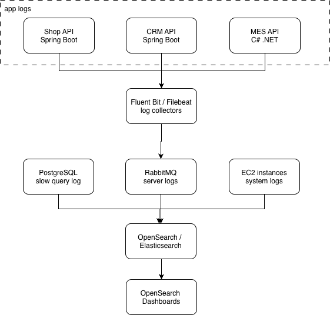

# Архитектурное решение по логированию

---

## 1. Мотивация

### Текущая ситуация

В настоящее время процесс разбора ошибок и нестандартных ситуаций в системе «Александрит» базируется на информации, предоставляемой клиентами:

* описания проблем носят субъективный характер;

* разработчикам приходится вручную искать данные в различных источниках;

* специалисты службы поддержки тратят значительное время на уточнение деталей;

* отсутствует единая точка доступа для просмотра всех событий системы.

### Обоснование внедрения централизованного логирования

**Логирование** — фундаментальный инструмент для понимания внутренней работы системы. В отличие от агрегированных метрик и трейсов, логи предоставляют:

* детальную информацию о каждом событии;

* контекст ошибок, включая stack traces и параметры;

* возможность поиска по любым полям;

* полную историю действий для проведения аудита.

### Технические метрики, на которые повлияет логирование

| # | Метрика | Описание |
|---|---------|----------|
| 1 | **MTTR (Mean Time To Recovery)** | Быстрый поиск причины сбоя по логам |
| 2 | **Время разбора обращений** | Поиск по order_id вместо угадывания |
| 3 | **Время на onboarding** | Новые разработчики быстрее понимают систему |

### Бизнес-метрики

| # | Метрика | Описание |
|---|---------|----------|
| 4 | **Удовлетворенность клиентов** | Быстрее решаем проблемы |
| 5 | **Снижение нагрузки на поддержку** | Самообслуживание через логи |

---

## 2. Анализ системы: какие логи собирать

### Схема с выделением источников логов



### Системы для сбора логов (приоритет)

| Приоритет | Система | Обоснование | Тип логов |
|-----------|---------|-------------|-----------|
| **1 (критичный)** | MES API | Ключевой сервис с проблемами производительности | Application logs |
| **2 (критичный)** | Shop API | Entry point для B2C, создание заказов | Application logs |
| **3 (критичный)** | CRM API | Подтверждение заказов | Application logs |
| **4 (важный)** | RabbitMQ | Место потери сообщений | Server logs |
| **5 (важный)** | PostgreSQL | Медленные запросы | Slow query log |
| **6 (желательный)** | EC2 instances | Системные события | Syslog |

---

## 3. Список логов уровня INFO

### Shop API

| Событие | Формат | Поля |
|---------|--------|------|
| Создание заказа | `Order created` | timestamp, order_id, customer_id, status=INITIATED |
| Загрузка 3D файла | `File uploaded` | timestamp, order_id, file_id, file_size, file_type |
| Отправка заказа | `Order submitted` | timestamp, order_id, customer_id, status=SUBMITTED |
| Получение статуса | `Order status retrieved` | timestamp, order_id, status |
| Вход пользователя | `User logged in` | timestamp, user_id, ip_address |

### CRM API

| Событие | Формат | Поля |
|---------|--------|------|
| Подтверждение заказа | `Order approved for manufacturing` | timestamp, order_id, seller_id, status=MANUFACTURING_APPROVED |
| Закрытие заказа | `Order closed` | timestamp, order_id, seller_id, status=CLOSED |
| Получение сообщения из RabbitMQ | `Message received from queue` | timestamp, queue_name, message_id, order_id |
| Отправка сообщения в RabbitMQ | `Message sent to queue` | timestamp, queue_name, message_id, order_id |

### MES API

| Событие | Формат | Поля |
|---------|--------|------|
| Начало расчета стоимости | `Price calculation started` | timestamp, order_id, model_complexity |
| Завершение расчета | `Price calculation completed` | timestamp, order_id, price, duration_ms |
| Оператор взял заказ | `Order assigned to operator` | timestamp, order_id, operator_id, status=MANUFACTURING_STARTED |
| Заказ выполнен | `Manufacturing completed` | timestamp, order_id, operator_id, status=MANUFACTURING_COMPLETED |
| Упаковка начата | `Packaging started` | timestamp, order_id, status=PACKAGING |
| Заказ отправлен | `Order shipped` | timestamp, order_id, status=SHIPPED, tracking_number |
| Получение сообщения из RabbitMQ | `Message received from queue` | timestamp, queue_name, message_id, order_id |
| Загрузка списка заказов | `Orders list retrieved` | timestamp, operator_id, filter, count, duration_ms |
| Получение файла из S3 | `File retrieved from storage` | timestamp, order_id, file_id, duration_ms |

### RabbitMQ (из server logs)

| Событие | Формат | Поля |
|---------|--------|------|
| Сообщение в DLQ | `Message moved to DLQ` | timestamp, original_queue, dlq_name, message_id, reason |
| Consumer отключился | `Consumer disconnected` | timestamp, queue_name, consumer_tag, reason |

---

## 4. Другие уровни логирования

### Уровни и когда использовать

| Уровень | Когда использовать | Примеры |
|---------|-------------------|---------|
| **ERROR** | Ошибки, требующие внимания | Исключения, failed операции, потеря соединения с БД |
| **WARN** | Потенциальные проблемы | Retry операции, высокая задержка, почти исчерпанные ресурсы |
| **INFO** | Значимые бизнес-события | Создание заказа, изменение статуса, вход пользователя |
| **DEBUG** | Детали для разработки | Параметры запросов, промежуточные состояния |
| **TRACE** | Максимальная детализация | Каждый SQL запрос, HTTP headers |

### Примеры логов по уровням

**ERROR:**
```json
{
  "level": "ERROR",
  "timestamp": "2024-01-15T10:30:45.123Z",
  "service": "mes-api",
  "message": "Failed to save order status",
  "order_id": "ORD-12345",
  "error": "Connection refused",
  "stack_trace": "...",
  "trace_id": "abc123"
}
```

**WARN:**
```json
{
  "level": "WARN",
  "timestamp": "2024-01-15T10:30:45.123Z",
  "service": "mes-api",
  "message": "Price calculation took longer than expected",
  "order_id": "ORD-12345",
  "duration_ms": 45000,
  "threshold_ms": 30000
}
```

**INFO:**
```json
{
  "level": "INFO",
  "timestamp": "2024-01-15T10:30:45.123Z",
  "service": "shop-api",
  "message": "Order created",
  "order_id": "ORD-12345",
  "customer_id": "CUST-789",
  "status": "INITIATED",
  "trace_id": "abc123"
}
```

### Настройка уровней по окружениям

| Окружение | Уровень по умолчанию | Примечание |
|-----------|---------------------|------------|
| **dev** | DEBUG | Максимум информации для разработки |
| **release** | DEBUG | Тестирование |
| **prod** | INFO | Только значимые события, ERROR всегда включен |

---

## 5. Приоритет внедрения: логирование vs трейсинг

### Рекомендуемый порядок

| Этап | Система | Что внедрять | Обоснование |
|------|---------|--------------|-------------|
| **1** | MES API | Логирование + Трейсинг | Главная проблемная система, нужны оба инструмента |
| **2** | Shop API | Трейсинг | Уже есть логирование Spring Boot, добавить tracing |
| **3** | CRM API | Трейсинг | Аналогично Shop API |
| **4** | RabbitMQ | Логирование | Для отслеживания потерь сообщений |
| **5** | PostgreSQL | Логирование (slow query) | Для оптимизации запросов |

### Почему MES первый

1. **Главный источник жалоб** - операторы жалуются на тормоза
2. **Нужна и детализация (логи), и путь запроса (трейсинг)**
3. **C# требует более явной настройки** чем Spring Boot (где логи есть из коробки)

---

## 6. Предлагаемое решение

### Архитектура логирования


### Выбор технологий

| Компонент | Технология | Обоснование |
|-----------|------------|-------------|
| **Log collector** | Fluent Bit | Легковесный, низкое потребление ресурсов, нативная поддержка K8s |
| **Storage & Search** | OpenSearch | Open-source форк Elasticsearch, Apache 2.0 лицензия, полная совместимость |
| **UI** | OpenSearch Dashboards | Бесплатный, полнофункциональный |

### Формат логов (структурированный JSON)

```json
{
  "timestamp": "2024-01-15T10:30:45.123Z",
  "level": "INFO",
  "service": "shop-api",
  "instance_id": "shop-api-1",
  "environment": "prod",
  "message": "Order created",
  "order_id": "ORD-12345",
  "customer_id": "CUST-789",
  "trace_id": "abc123def456",
  "span_id": "span789"
}
```

**Обязательные поля:**
- `timestamp` - время события (ISO 8601)
- `level` - уровень логирования
- `service` - имя сервиса
- `message` - описание события
- `trace_id` - для корреляции с трейсами (из OpenTelemetry)

---

## 7. Политика безопасности

### Работа с чувствительными данными

| Тип данных | Правило | Пример |
|------------|---------|--------|
| **Пароли** | НИКОГДА не логировать | - |
| **API ключи** | НИКОГДА не логировать | - |
| **Email** | Маскировать | `j***@example.com` |
| **Телефон** | Маскировать | `+7***1234` |
| **Номер карты** | Только последние 4 цифры | `****1234` |
| **Адрес** | Только город | `Москва` |
| **Order ID** | Можно логировать полностью | `ORD-12345` |
| **Customer ID** | Можно логировать полностью | `CUST-789` |

### Доступ к логам

| Роль | Доступ | Примечание |
|------|--------|------------|
| **Разработчики** | Свои сервисы, все уровни | Фильтр по service.name |
| **DevOps** | Все сервисы, все уровни | Полный доступ для диагностики |
| **Поддержка** | Все сервисы, INFO и выше | Без DEBUG/TRACE |
| **Аудиторы** | Только аудит-логи | Отдельный индекс |
| **Операторы MES** | Нет доступа | Используют UI MES |

### Аутентификация и авторизация

- **SSO интеграция** с корпоративным IdP
- **RBAC** в OpenSearch (роли, пользователи)
- **Audit log** доступа к логам

---

## 8. Политика хранения

### Индексы

| Индекс | Источники | Retention | Размер (оценка) |
|--------|-----------|-----------|-----------------|
| `logs-shop-api-*` | Shop API | 30 дней | ~10 GB/месяц |
| `logs-crm-api-*` | CRM API | 30 дней | ~5 GB/месяц |
| `logs-mes-api-*` | MES API | 30 дней | ~15 GB/месяц |
| `logs-rabbitmq-*` | RabbitMQ | 14 дней | ~2 GB/месяц |
| `logs-postgres-*` | PostgreSQL slow queries | 14 дней | ~1 GB/месяц |
| `logs-audit-*` | Аудит-события | 365 дней | ~500 MB/месяц |

### Rotation policy

- **Daily rotation** - новый индекс каждый день
- **Index naming** - `logs-{service}-{date}`
- **Alias** - `logs-{service}` для поиска по всем дням

### Архивация

- Логи старше retention → в S3 (cold storage)
- Сжатие: gzip
- Доступ: по запросу, восстановление за 24 часа

---

## 9. Анализ логов и алертинг

### Нужен ли алертинг на основе логов?

**Да, но ограниченно:**

| Алерт | Условие | Действие |
|-------|---------|----------|
| `HighErrorRate` | > 10 ERROR/мин в одном сервисе | Уведомление в Telegram |
| `CriticalError` | Специфичные паттерны (OOM, DB connection failed) | Уведомление + звонок |
| `DLQMessage` | Лог о попадании в DLQ | Уведомление в канал поддержки |
| `SlowQueryDetected` | slow query > 10 сек | Тикет на оптимизацию |

### Поиск аномалий

**Сценарии для обнаружения:**

| Аномалия | Описание | Реакция |
|----------|----------|---------|
| Резкий рост ошибок | Было 4 ERROR/мин, стало 100 | Возможно DDoS или деплой сломал |
| Резкий рост INFO | Было 100 создан заказ/мин, стало 10000 | Возможна атака, спам-боты |
| Падение количества логов | Было 1000 логов/мин, стало 0 | Сервис упал или потеряно соединение |

### Инструменты анализа

1. **OpenSearch Anomaly Detection** - ML-based обнаружение аномалий
2. **Saved queries** - преднастроенные поиски (ошибки по order_id, etc.)
3. **Dashboards** - визуализация трендов

---

## 10. План внедрения

| Этап | Задачи | Срок |
|------|--------|------|
| **1. Инфраструктура** | Развернуть OpenSearch cluster + Fluent Bit | Неделя 1 |
| **2. MES API** | Настроить Serilog, структурированные логи | Неделя 2 |
| **3. Shop/CRM API** | Обновить Logback конфигурацию | Неделя 3 |
| **4. RabbitMQ** | Настроить export server logs | Неделя 3 |
| **5. PostgreSQL** | Настроить slow query log | Неделя 4 |
| **6. Dashboards** | Создать дашборды для поддержки | Неделя 4 |
| **7. Alerts** | Настроить алертинг | Неделя 5 |
| **8. RBAC** | Настроить роли и доступы | Неделя 5 |
| **9. Документация** | Runbooks, обучение | Неделя 6 |

---

## 11. Сравнение технологий (дополнительное задание)

### Критерии выбора

| Критерий | ELK Stack | OpenSearch | Splunk | Loki (Grafana) | Graylog |
|----------|-----------|------------|--------|----------------|---------|
| **Лицензия** | Elastic License 2.0 (ограничения) | Apache 2.0 | Проприетарная | AGPL v3 | SSPL / Enterprise |
| **Стоимость** | Бесплатно (basic) / Платно (features) | Бесплатно | Очень высокая | Бесплатно | Бесплатно / Enterprise |
| **Масштабируемость** | Высокая | Высокая | Очень высокая | Высокая | Средняя |
| **Полнотекстовый поиск** | Отличный | Отличный | Отличный | Ограниченный (labels) | Хороший |
| **Сложность настройки** | Средняя | Средняя | Низкая (SaaS) | Низкая | Средняя |
| **Интеграция с K8s** | Хорошая | Хорошая | Хорошая | Отличная | Хорошая |
| **Экосистема** | Богатая | Совместима с ELK | Богатая | Grafana stack | Ограниченная |
| **Поддержка в РФ** | Ограничена | Доступна | Ограничена | Доступна | Доступна |

### Выбор решения для логирования: OpenSearch vs Loki

**Преимущества:**
* Лицензия Apache 2.0 — отсутствие лицензионных ограничений.

* Полная совместимость с Elasticsearch API — упрощает миграцию и интеграцию для команд, знакомых с Elasticsearch.

* Активное сообщество и развитие — регулярные обновления, поддержка и обмен опытом.

* Доступность в Yandex Cloud (Managed OpenSearch) — возможность использовать управляемый сервис для снижения нагрузки на команду.

* Богатые возможности поиска и анализа — поддержка сложных запросов, агрегаций и визуализации данных.

**Недостатки:**
* требует настройки и администрирования (в т. ч. при самостоятельном развёртывании);

* потребляет больше ресурсов по сравнению с Loki;

* есть кривая обучения для работы с языком запросов.

### Альтернатива: Loki

**Когда предпочтительнее выбрать Loki:**
* если в инфраструктуре уже используется Grafana (нативная интеграция);

* требуется интеграция с Prometheus для совместного мониторинга метрик и логов;

* основной сценарий использования — поиск по меткам (labels), а не полнотекстовый поиск;

* ограничен бюджет на инфраструктуру — Loki более экономичен в плане потребления ресурсов.

---

## 12. C4 диаграмма с логированием

Обновленная диаграмма находится в файле: `Task4/jewerly_c4_model_with_logging.drawio`

Новые компоненты:
- Fluent Bit (collectors на каждом сервисе)
- OpenSearch Cluster
- OpenSearch Dashboards